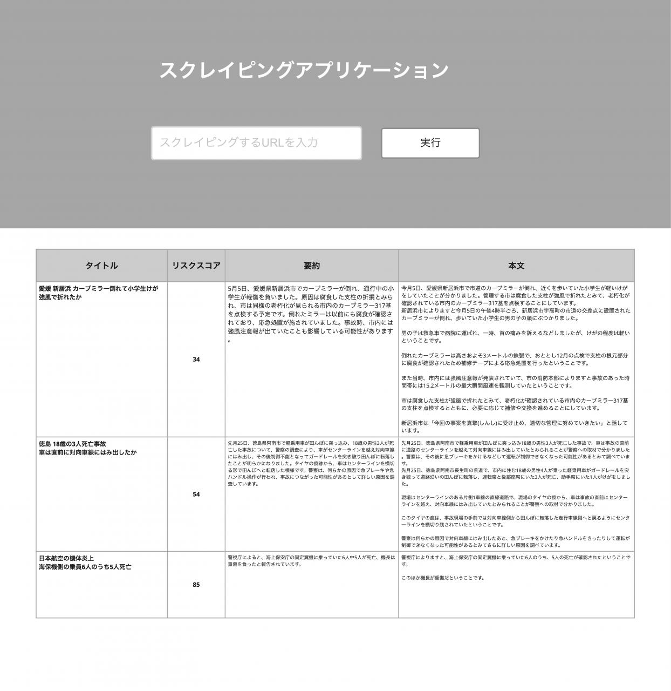

# NHK ニュース スクレイピング & AI分析システム

## 概要

このプロジェクトは、NHKのニュースサイトから記事を自動的にスクレイピングし、OpenAI APIを使用して各記事の要約生成とリスクスコア評価を行うRailsアプリケーションです。

## 実際のアプリケーション画面




## 主な機能

- **NHKニュース記事の自動スクレイピング**
  - 指定されたNHKニュース記事のURLから記事情報を取得
  - 記事のタイトル、投稿時刻、本文を抽出
  - 複数の記事を一度に処理（最大3件）

- **AI による記事分析**
  - OpenAI GPT-3.5-turboを使用した記事の自動要約
  - 独自のリスクスコア評価システム（0-100点）
  - リスクスコアは以下の5つの要素で評価：
    - 被害範囲（0-20点）
    - 被害程度（0-20点）
    - 社会的影響（0-20点）
    - 死傷者数（0-20点）
    - 被害金額（0-20点）

- **Web インターフェース**
  - スクレイピングされた記事の一覧表示
  - 各記事の詳細ページ
  - 要約とリスクスコアの表示

## 技術スタック

- **Backend**: Ruby on Rails 7.0.4.3
- **Ruby**: 3.2.4
- **Database**: PostgreSQL / SQLite3
- **Web Scraping**: Selenium WebDriver + Google Chrome
- **AI**: OpenAI API (GPT-3.5-turbo)
- **Styling**: Sass
- **Testing**: Minitest, Capybara

## セットアップ

### 前提条件

- Ruby 3.2.4
- Rails 7.0.4.3
- Google Chrome ブラウザ
- ChromeDriver
- OpenAI API キー

### 1. 依存関係のインストール

```bash
bundle install
```

### 2. ChromeDriverのセットアップ

```bash
# macOS (Homebrew使用)
brew install chromedriver

# または、手動でダウンロード
# https://chromedriver.chromium.org/
```

### 3. 環境設定

OpenAI APIキーの設定が必要です：

```ruby
# app/controllers/articles_controller.rb の以下の行を編集
@client = OpenAI::Client.new(access_token: 'YOUR_OPENAI_API_KEY')
```

### 4. データベースの作成とマイグレーション

```bash
rails db:create
rails db:migrate
```

## 使用方法

### サーバーの起動

```bash
rails server
```

アプリケーションは `http://localhost:3000` でアクセス可能です。

### 記事のスクレイピング

現在、以下のURLのスクレイピングに対応しています：
- https://www3.nhk.or.jp/news/word/0001539.html

スクレイピングを実行するには：

```bash
# ブラウザから
POST /articles/scrape?url=https://www3.nhk.or.jp/news/word/0001539.html

# または、Railsコンソールから
rails console
> ArticlesController.new.scrape_articles("https://www3.nhk.or.jp/news/json16/word/0001539_001.json?_=1720541485092")
```

## APIエンドポイント

- `GET /` - ホームページ（記事一覧）
- `GET /articles` - 記事一覧
- `GET /articles/:id` - 特定の記事の詳細
- `POST /articles/scrape` - 記事のスクレイピング実行

## データベーススキーマ

### Articles テーブル

| カラム | 型 | 説明 |
|--------|----|----|
| id | integer | 主キー |
| title | string | 記事タイトル |
| time | string | 投稿時刻 |
| content | text | 記事本文 |
| summary | text | AI生成要約 |
| risk_score | integer | リスクスコア（0-100） |
| created_at | datetime | 作成日時 |
| updated_at | datetime | 更新日時 |

## 開発

### テストの実行

```bash
# 全テストの実行
rails test

# 特定のテストファイルの実行
rails test test/controllers/articles_controller_test.rb
```